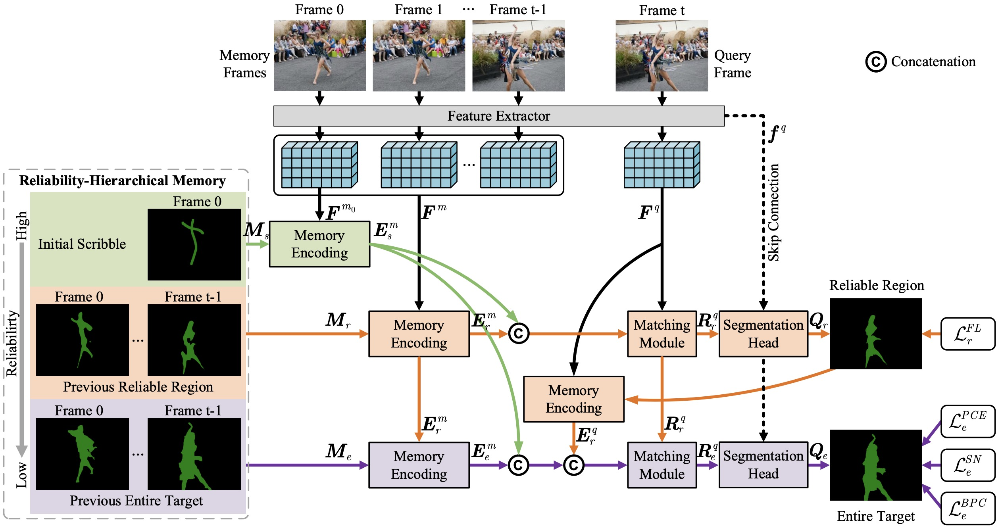
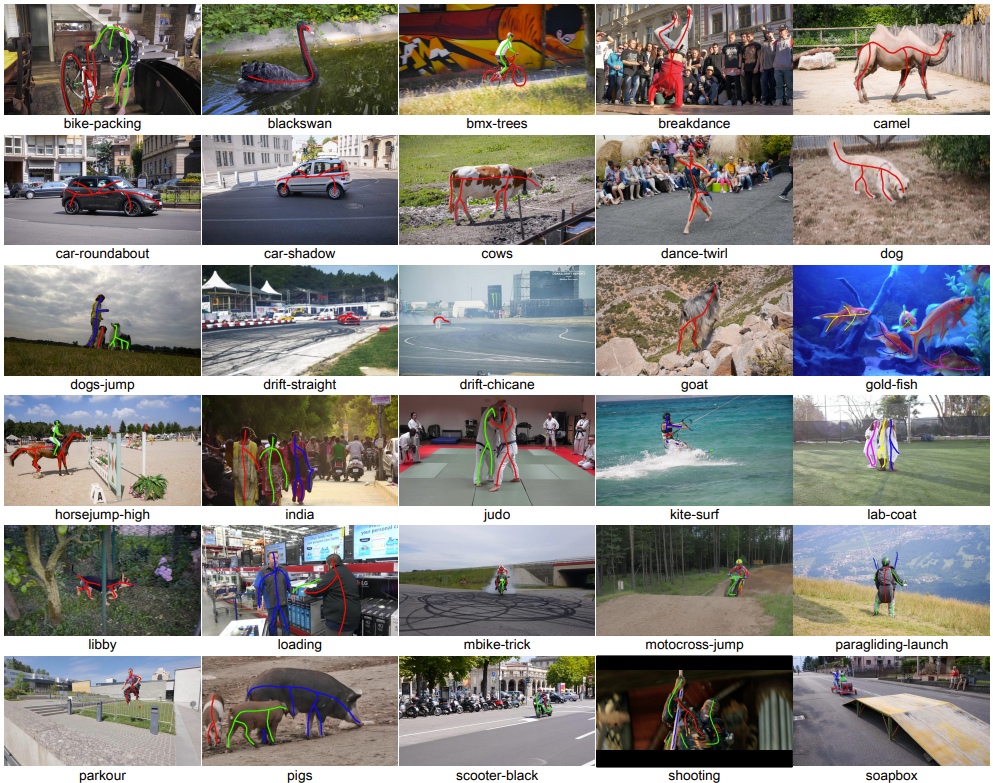
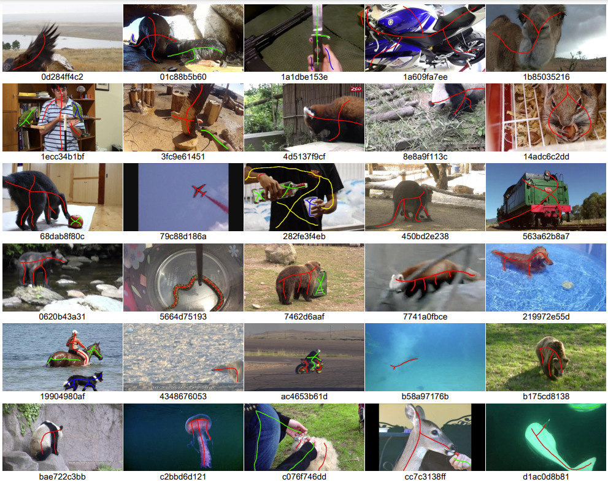

# RHMNet-for-SSVOS

This paper aims to solve the video object segmentation (VOS) task in a scribble-supervised manner, in which VOS models are not only trained by the sparse scribble annotations but also initialized with the sparse target scribbles for inference. Thus, the annotation burdens for both training and initialization can be substantially lightened. The difficulties of scribble-supervised VOS lie in two aspects. On the one hand, it requires the powerful ability to learn from the sparse scribble annotations during training. On the other hand, it demands strong reasoning capability during inference given only a sparse initial target scribble. In this work, we propose a Reliability-Hierarchical Memory Network (RHMNet) to predict the target mask in a step-wise expanding strategy w.r.t. the memory reliability level. To be specific, RHMNet first only uses the memory in the high reliability level to locate the region with high reliability belonging to the target, which is highly similar to the initial target scribble. Then it expands the located high-reliability region to the entire target conditioned on the region itself and the memories in all reliability levels. Besides, we propose a scribble-supervised learning mechanism to facilitate the learning of our model to predict dense results. It mines the pixel-level relation within the single frame and the frame-level relation within the sequence to take full advantage of the scribble annotations in sequence training samples. The favorable performance on two popular benchmarks demonstrates that our method is promising.
> **Reliablity-Hierarchical Memory Network for Scribble-Supervised Video Object Segmentation**, Zikun Zhou, Kaige Mao, Wenjie Pei, Hongpeng Wang, Yaowei Wang, Zhenyu He. [[Paper]()]

## Framework of our RHMNet


Our Reliability-Hierarchical Memory Network consists of the reliability-hierarchical memory bank, the feature extractor, the memory encoding module, the matching module, and the segmentation head. For processing a new frame, RHMNet first captures the reliable region, which is the region highly similar to the initial target scribble region, and then accordingly segments the entire target. In each expanding step, only the historical information in the corresponding or higher reliability level is used as the reference for memory matching.

## Scribble Samples

Synthesized training scribbles

Manually drawn evaluation scribbles

- DAVIS

- Youtube-VOS


## Download the Scribble Annotations

The synthesized scribble annotations used for training could be download from here: [[GoogleDriver](https://drive.google.com/drive/folders/1VbRXU9PZjSJ4qQDGRapGXGAsB6XhpLru?usp=sharing)] [[BaiduYun(code:o2ey)](https://pan.baidu.com/s/1_8fFs1QP2Pta-DXrqzmWrA)]

The manully drawn initial scribbles for the validation set of DAVIS and Youtube-VOS could be download from here:  [[GoogleDriver](https://drive.google.com/file/d/17vQd9jmhprWflIsy8kntSOf-d51RPZWL/view?usp=sharing)] [[BaiduYun(code:yhdj)](https://pan.baidu.com/s/1ir6h3RGa1uRiI6XTIdMREw)]

In the annotation file of a frame with $N$ objects, the region with a value of $n$ means the scribble of the $n$-th object, the region with a value of $N+1$ means the scribble of the background, and the region with a value of $0$ means the unlabeled region.

## Training and Evaluation

### Data preparation
The downloaded scribbles should be organized as follows:
```
/datasets
    |——————COCO
            |——————scribbles
                        |——————annotation1.bmp
                        |——————annotation2.bmp
                        |——————......
            |——————COCO_scribbles.json
            |——————...
    |——————DAVIS
            |——————train_scribbles
                          |——————video1
                          |——————video2
                          |——————......
            |——————valid_scribbles0
                          |——————video1
                          |——————video2
                          |——————......
            |——————valid_scribbles1
            |——————valid_scribbles2
            |——————valid_scribbles3
            |——————valid_scribbles4
            |——————...
    |——————Youtube-VOS
            |——————train_scribbles
                          |——————video1
                          |——————video2
                          |——————......
            |——————valid_scribbles
                          |——————video1
                          |——————video2
                          |——————......
            |——————...
```
### Training
```
# pre-training on coco
/opt/conda/bin/python -m torch.distributed.launch --nproc_per_node 8 train_script_pretrain.py --config pre_training
# video training on davis and youtube-vos
/opt/conda/bin/python -m torch.distributed.launch --nproc_per_node 4 train_script_video_training.py --config video_training
```
### Evaluation
The pre-trained models could be downloaded from here:[[GoogleDriver](https://drive.google.com/file/d/1IudDE9ulUUvIKkS8dsApW9-Wac6j6a2_/view?usp=share_link)] [[BaiduYun(code:ghbg)](https://pan.baidu.com/s/1i8SYXyrprnyiDSI2zCFNtw)], and should be put to the path of `./checkpoints/pretrain_weights_video_training`.
```
# evaluation on davis 2016 validation set
/opt/conda/bin/python eval_davis.py --gpu 0 --set val --year 16 --config video_training --ckpt_num 69
# evaluation on davis 2017 validation set
/opt/conda/bin/python eval_davis.py --gpu 0 --set val --year 17 --config video_training --ckpt_num 78
# evaluation on youtube-vos 2018/2019 validation set
/opt/conda/bin/python eval_ytb.py --gpu 0 --set val --config video_training --ckpt_num 71 --size 1000
```